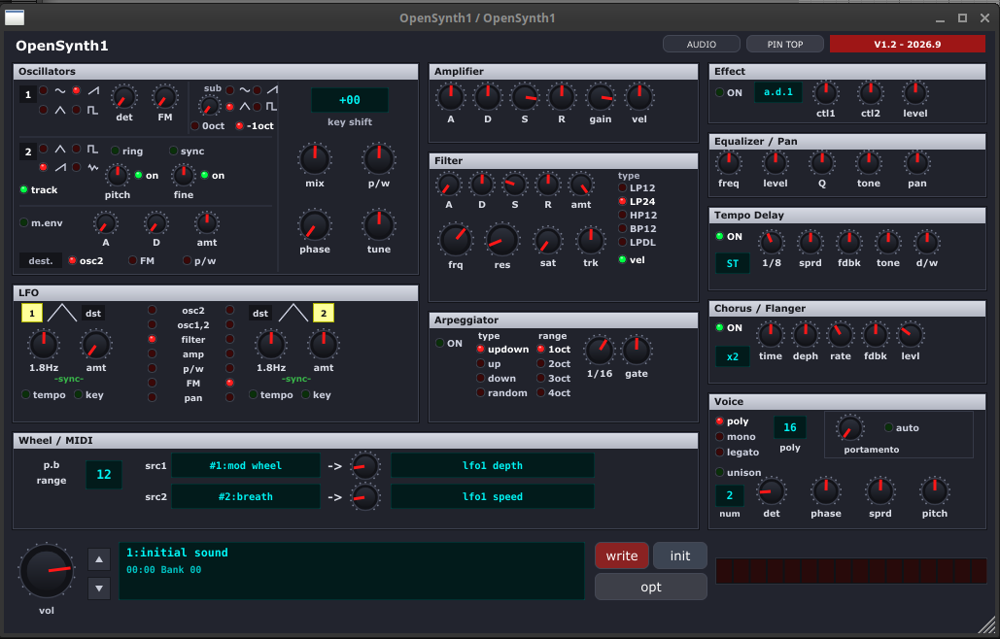

# OpenSynth1

> **OpenSynth1** is a tribute-focused virtual-analog / FM synthesizer plugin and standalone app with its own DSP shaping, UI, preset handling, and ADSR behaviour. It is inspired by the classic Synth1 workflow and the Nord Lead 2 feel, but it is not a byte-for-byte clone of Daichi Laboratory's original Synth1.



> This repository is a tribute project for the Synth1 aesthetic and sound architecture, with a custom ADSR implementation that intentionally differs from the original Synth1 mapping when loading existing bank presets. The ADSR curve and timing are tweaked for a more pronounced, personal attack / release response.

---

## ✨ Features

### 🎛 Oscillators & Sound Generation
* **Oscillator 1**:
  * Waveforms: **Sine**, **Saw**, **Pulse** (with variable pulse width and PW modulation), and **Triangle**.
  * **Sub-Oscillator**: 1 or 2 octaves below Osc 1 for massive sub-bass weight.
  * **Frequency Modulation (FM)**: Audio-rate modulation of Osc 1 frequency by Osc 2.
* **Oscillator 2**:
  * Waveforms: **Saw**, **Pulse**, **Triangle**, and **White Noise**.
  * Semi-tone Pitch (-24 to +24) and Fine-tune (-64 to +63).
  * **Hard Sync**: Phase syncs Osc 2 to Osc 1 for piercing lead sounds.
  * **Ring Modulation**: True analog-style ring modulation between Osc 1 and Osc 2.
  * Keyboard tracking on/off.
* **Oscillator Modulation Envelope**:
  * Dedicated Pitch/Mod envelope with variable Attack/Decay and depth routing to Osc 2 Pitch or FM.

### 🎚 Multi-Mode Filter
* **Filter Types**:
  * 24 dB/oct Low Pass (Warm ladder-style response)
  * 12 dB/oct Low Pass
  * 12 dB/oct Band Pass
  * 12 dB/oct High Pass
* Filter controls: Cutoff, Resonance, Saturation (drive), and Keyboard tracking.
* Dedicated **Filter ADSR Envelope** with bipolar envelope amount (-64 to +63).

### ⚡ Modulation & Envelopes
* **Dual LFOs (LFO 1 & LFO 2)**:
  * Waveforms: Triangle, Saw Down, Square, Random (Sample & Hold).
  * Tempo sync to host / internal BPM with musical beat divisions (`1/1`, `1/2`, `1/4`, `1/8`, `1/16`, triplets, dotted), or free running frequency in Hz.
  * Flexible routing to Pitch, Filter Cutoff, Osc 2 Pitch, Pan, and Amp.
* **MIDI Modulation Routing**:
  * Real-time routing from Mod Wheel (CC 1), Aftertouch (Channel Pressure), Pitch Bend, Breath, and Foot Pedal to any parameter target.
* **Amplifier Section**:
  * Full **Amp ADSR Envelope**.
  * Gain and Velocity Sensitivity control.

### 🎹 Voice Architecture & Performance
* Up to **32-voice polyphony**.
* Play modes: **Poly**, **Mono**, and **Legato** (with legato glide).
* **Unison**: Multi-voice stacking with adjustable detune and stereo spread.
* **Portamento / Glide**: Time control and Auto-glide mode.
* **Arpeggiator**:
  * Modes: Up, Down, Up/Down, Random.
  * Beat sync (1/4 to 1/32, dotted & triplets), Octave range (1 to 4 octaves), and Gate length.

### 🔊 Built-in Studio Effects
* **Stereo Delay**: Host BPM sync, feedback, wet/dry mix.
* **Chorus / Flanger**: Depth, rate, and feedback for lush stereo widening.
* **Distortion / Overdrive**: Analog saturation for added bite and harmonics.
* **Tone / EQ**: Two-band shelving tone control.

### 💾 Preset Compatibility
* **Full .sy1 format compatibility**: Can import and export original Synth1 bank `.sy1` preset files!
* Built-in preset browser and program selector.
* Options dialog for customizing color schemes and global settings.

---

## 🚀 Releases & Downloads

Pre-built binaries for **Linux x86_64** are available in the [**GitHub Releases**](https://github.com/letsdig/OpenSynth1/releases) section:

| File | Type | Architecture | Description |
| :--- | :--- | :--- | :--- |
| `OpenSynth1-Linux-x86_64-vst3.tar.gz` | VST3 Plugin | Linux x86_64 | Standard VST3 bundle for DAWs (Bitwig, Reaper, Ardour, Renoise, etc.) |
| `OpenSynth1-Linux-x86_64-standalone.tar.gz` | Standalone App | Linux x86_64 | Standalone executable with direct ALSA / JACK / PulseAudio / PipeWire support |

*(Also available as `.zip` archives)*

### 🖥️ System Requirements

The pre-built binaries are compiled on **Ubuntu 22.04** and require **glibc ≥ 2.35**.

This covers:
- Ubuntu 22.04 LTS (Jammy) and later
- Debian 12 (Bookworm) and later
- Linux Mint 21 and later
- Fedora 36 and later
- Most distros released after 2022

**Not sure which glibc version you have?** Run this in your terminal:

```bash
ldd --version | head -n 1
```

Example output:
```
ldd (GNU libc) 2.36
```

If the number shown is **≥ 2.35** → you're good to go ✅

If it's **< 2.35 and not working** → 🫏 **BRUTTO SOMARO** you'll need to build from source (see below) or upgrade your distro — instead of harassing the creator with kids vibe coding jokes.

---

### 📦 Installation (Linux)

#### VST3 Plugin:
1. Download `OpenSynth1-Linux-x86_64-vst3.tar.gz` from the Releases page.
2. Extract the archive:
   ```bash
   tar -xzvf OpenSynth1-Linux-x86_64-vst3.tar.gz
   ```
3. Copy `OpenSynth1.vst3` to your user VST3 directory:
   ```bash
   mkdir -p ~/.vst3
   cp -r OpenSynth1.vst3 ~/.vst3/
   ```
4. Rescan plugins in your DAW.

#### Standalone Application:
1. Download `OpenSynth1-Linux-x86_64-standalone.tar.gz`.
2. Extract and run:
   ```bash
   tar -xzvf OpenSynth1-Linux-x86_64-standalone.tar.gz
   ./OpenSynth1
   ```

---

## 🛠️ Building from Source

### Prerequisites (Debian / Ubuntu / Linux Mint)
```bash
sudo apt-get update
sudo apt-get install -y build-essential libasound2-dev libfreetype6-dev \
    libx11-dev libxinerama-dev libxext-dev libfontconfig1-dev libcurl4-openssl-dev \
    libgl1-mesa-dev libgtk-3-dev pkg-config
```

### Compiling
```bash
git clone https://github.com/letsdig/OpenSynth1.git
cd OpenSynth1

# Clone the JUCE framework if not already installed:
git clone --depth 1 https://github.com/juce-framework/JUCE.git ../JUCE

cd Builds/LinuxMakefile
make CONFIG=Release -j$(nproc)
```

The compiled binaries will be located in `Builds/LinuxMakefile/build/`:
* `OpenSynth1.vst3` (VST3 bundle, copy to `~/.vst3/`)
* `OpenSynth1` (Standalone executable)

---

## 📜 Credits & Disclaimer
* Inspired by **Ichiro Toda** (Daichi Laboratory), creator of the legendary **Synth1** (2002).
* Architecture modeled on the hardware **Clavia Nord Lead 2**.
* Built with the [JUCE Framework](https://juce.com).

> [!NOTE]
> **Trademark & Legal Notice**:
> Synth1 is a software instrument created and owned by Ichiro Toda / Daichi Laboratory. Clavia and Nord Lead are registered trademarks of Clavia DMI AB.
> **OpenSynth1** is an independent, non-commercial, open-source educational recreation and is not affiliated with, endorsed by, or connected to Ichiro Toda, Daichi Laboratory, or Clavia DMI AB.

## 📄 License
MIT License. See `LICENSE` for details.
